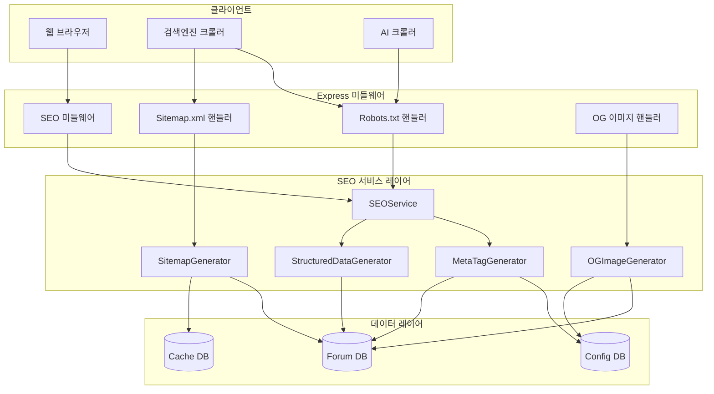

# SEO 최적화 설계 문서

## 개요

본 문서는 Node.js + Express.js 기반 커뮤니티 포럼 사이트의 검색엔진 최적화(SEO) 및 AI 크롤러 친화적 기능 구현을 위한 설계를 정의합니다. 이 시스템은 검색엔진(Google, Naver, Bing)과 AI 크롤러(GPTBot, Claude-Web 등)가 포럼 콘텐츠를 효과적으로 크롤링하고 인덱싱할 수 있도록 메타데이터, 구조화된 데이터, sitemap 등을 제공합니다.

### 설계 목표

1. 검색엔진 친화적인 메타데이터 자동 생성
2. 소셜 미디어 공유 최적화 (Open Graph, Twitter Card)
3. 구조화된 데이터(JSON-LD) 제공으로 리치 스니펫 지원
4. 동적 sitemap.xml 생성 및 캐싱
5. AI 크롤러 접근 규칙 명시
6. 게시글별 대표 이미지 자동 생성
7. 페이지 로딩 성능 유지

### 기술 스택

- Node.js + Express.js (기존 프레임워크)
- EJS 템플릿 엔진 (메타 태그 렌더링)
- SQLite (og_images 테이블, cache.db 추가)
- Canvas API (대표 이미지 생성)
- SQLite 캐싱 (sitemap 캐싱)

## 아키텍처

### 시스템 구성도



### 레이어 구조

1. **라우팅 레이어**: Express 라우터에서 SEO 관련 엔드포인트 처리
2. **미들웨어 레이어**: 모든 페이지 요청에 SEO 데이터 주입
3. **서비스 레이어**: SEO 로직 구현 (메타 태그, 구조화된 데이터, sitemap 생성)
4. **데이터 레이어**: 데이터베이스 및 캐시 관리

## 컴포넌트 및 인터페이스

### 1. SEOService

SEO 기능의 중앙 관리 서비스입니다.

```javascript
class SEOService {
    constructor(dbManager)
    
    // 페이지별 SEO 데이터 생성
    generatePageSEO(pageType, data)
    
    // 메타 태그 생성
    generateMetaTags(pageType, data)
    
    // 구조화된 데이터 생성
    generateStructuredData(pageType, data)
    
    // Canonical URL 생성
    generateCanonicalURL(req, data)
}
```

### 2. MetaTagGenerator

동적 메타 태그 생성을 담당합니다.

```javascript
class MetaTagGenerator {
    // 기본 메타 태그 생성
    generateBasicMeta(title, description, keywords)
    
    // Open Graph 메타 태그 생성
    generateOpenGraphMeta(data)
    
    // Twitter Card 메타 태그 생성
    generateTwitterCardMeta(data)
    
    // 게시글 메타 태그 생성
    generatePostMeta(post, subforum, siteUrl)
    
    // 카테고리 메타 태그 생성
    generateCategoryMeta(subforum, siteUrl)
    
    // 메인 페이지 메타 태그 생성
    generateHomeMeta(siteUrl)
    
    // 설명 텍스트 추출 (160자 제한)
    extractDescription(content, maxLength = 160)
}
```

### 3. StructuredDataGenerator

JSON-LD 형식의 구조화된 데이터를 생성합니다.

```javascript
class StructuredDataGenerator {
    // WebSite 스키마 생성
    generateWebSiteSchema(siteUrl, siteName)
    
    // Article 스키마 생성
    generateArticleSchema(post, author, siteUrl)
    
    // BreadcrumbList 스키마 생성
    generateBreadcrumbSchema(breadcrumbs, siteUrl)
    
    // CollectionPage 스키마 생성
    generateCollectionPageSchema(subforum, siteUrl)
    
    // SearchResultsPage 스키마 생성
    generateSearchResultsSchema(query, results, siteUrl)
}
```

### 4. SitemapGenerator

동적 sitemap.xml을 생성하고 캐싱합니다.

```javascript
class SitemapGenerator {
    constructor(dbManager)
    
    // Sitemap 생성
    async generateSitemap()
    
    // Sitemap 캐시 조회 (cache.db에서)
    async getCachedSitemap()
    
    // Sitemap 캐시 저장 (cache.db에)
    async saveCachedSitemap(xmlContent)
    
    // Sitemap 캐시 갱신
    async refreshCache()
    
    // 캐시 유효성 확인
    async isCacheValid()
    
    // URL 엔트리 생성
    createURLEntry(loc, lastmod, changefreq, priority)
    
    // 게시글 URL 목록 조회
    async getPostURLs()
    
    // 카테고리 URL 목록 조회
    async getCategoryURLs()
}
```

### 5. OGImageGenerator

게시글별 대표 이미지를 자동 생성합니다.

```javascript
class OGImageGenerator {
    constructor(dbManager)
    
    // 대표 이미지 생성
    async generateImage(post, subforum, author)
    
    // 이미지 데이터베이스 저장
    async saveImage(postId, imageBuffer)
    
    // 이미지 조회
    async getImage(postId)
    
    // 이미지 재생성
    async regenerateImage(postId)
    
    // 기본 이미지 반환
    getDefaultImage()
    
    // 텍스트 줄바꿈 처리
    wrapText(ctx, text, maxWidth)
}
```

### 6. SEO 미들웨어

모든 페이지 요청에 SEO 데이터를 주입합니다.

```javascript
function seoMiddleware(req, res, next) {
    // res.locals에 SEO 헬퍼 함수 추가
    res.locals.seo = {
        metaTags: '',
        structuredData: '',
        canonicalURL: ''
    };
    next();
}
```

## 데이터 모델

### og_images 테이블 (Config DB)

게시글별 자동 생성된 대표 이미지를 저장합니다.

```sql
CREATE TABLE IF NOT EXISTS og_images (
    id INTEGER PRIMARY KEY AUTOINCREMENT,
    post_id INTEGER NOT NULL,
    category_id INTEGER NOT NULL,
    image_data BLOB NOT NULL,
    mime_type VARCHAR(50) DEFAULT 'image/png',
    width INTEGER DEFAULT 1200,
    height INTEGER DEFAULT 630,
    created_at DATETIME DEFAULT CURRENT_TIMESTAMP,
    updated_at DATETIME DEFAULT CURRENT_TIMESTAMP,
    UNIQUE(post_id, category_id)
);

CREATE INDEX IF NOT EXISTS idx_og_images_post_category 
ON og_images(post_id, category_id);
```

### cache 테이블 (Cache DB)

Sitemap 및 기타 캐시 데이터를 저장합니다.

```sql
CREATE TABLE IF NOT EXISTS cache (
    key VARCHAR(255) PRIMARY KEY,
    value TEXT NOT NULL,
    expires_at DATETIME NOT NULL,
    created_at DATETIME DEFAULT CURRENT_TIMESTAMP,
    updated_at DATETIME DEFAULT CURRENT_TIMESTAMP
);

CREATE INDEX IF NOT EXISTS idx_cache_expires_at ON cache(expires_at);
```

### 사이트 설정 (site_settings 테이블 확장)

SEO 관련 설정을 저장합니다.

```sql
-- 기존 site_settings 테이블에 추가할 설정들
INSERT OR IGNORE INTO site_settings (key, value) VALUES
('site_name', '커뮤니티 포럼'),
('site_description', '다양한 주제로 소통하는 커뮤니티 포럼입니다.'),
('site_url', 'https://example.com'),
('site_keywords', '포럼, 커뮤니티, 게시판'),
('og_default_image', '/images/og-default.png'),
('twitter_site', '@example'),
('sitemap_cache_duration', '3600');
```

## Correctness Properties

*속성(Property)은 시스템의 모든 유효한 실행에서 참이어야 하는 특성 또는 동작입니다. 본질적으로 시스템이 수행해야 하는 작업에 대한 공식적인 설명입니다. 속성은 사람이 읽을 수 있는 사양과 기계가 검증할 수 있는 정확성 보장 사이의 다리 역할을 합니다.*


### 속성 반영 (Property Reflection)

prework 분석 결과를 검토하여 중복되거나 통합 가능한 속성들을 식별합니다:

중복 제거 및 통합:
- 1.4, 2.1, 2.4, 3.1, 6.1, 10.1: 모든 페이지에 특정 태그가 포함되는 것 → "모든 페이지 필수 메타데이터" 속성으로 통합
- 2.2, 2.5: OG와 Twitter Card의 필수 속성 → "소셜 미디어 메타데이터 완전성" 속성으로 통합
- 1.6, 1.8, 11.1, 11.8: 대표 이미지 생성 및 저장 → "대표 이미지 생성 라운드트립" 속성으로 통합
- 11.3, 11.4, 11.5, 11.6: 대표 이미지에 포함되는 정보 → "대표 이미지 필수 정보" 속성으로 통합
- 5.3: sitemap URL 엔트리의 필수 요소 → 각 URL 타입별 속성에 통합
- 4.3, 4.4, 4.5: robots.txt의 Disallow 규칙 → "robots.txt 차단 규칙" 예제로 통합

최종 속성 목록:
- Property 1: 모든 페이지 필수 메타데이터 (1.4, 2.1, 2.4, 3.1, 6.1, 10.1 통합)
- Property 2: 카테고리 페이지 메타 태그 정확성 (1.2)
- Property 3: 게시글 페이지 메타 태그 정확성 (1.3)
- Property 4: Description 길이 제한 (1.5)
- Property 5: 소셜 미디어 메타데이터 완전성 (2.2, 2.5 통합)
- Property 6: 게시글 OG 이미지 URL 형식 (2.6, 2.7)
- Property 7: Article 스키마 필수 속성 (3.4)
- Property 8: 카테고리 페이지 스키마 타입 (3.5)
- Property 9: 하위 페이지 Breadcrumb (3.7)
- Property 10: Sitemap 공개 게시글 일치 (5.2)
- Property 11: Sitemap URL 우선순위 (5.5, 5.6)
- Property 12: Sitemap changefreq 규칙 (5.7, 5.8)
- Property 13: Sitemap URL 개수 제한 (5.9)
- Property 14: Canonical URL 쿼리 파라미터 제거 (6.2)
- Property 15: Canonical URL 절대 경로 (6.4)
- Property 16: 메타 태그 생성 성능 (7.1)
- Property 17: Sitemap 캐싱 동작 (7.3)
- Property 18: X-Robots-Tag 헤더 포함 (8.4)
- Property 19: 페이지네이션 링크 (9.3)
- Property 20: 검색 결과 동적 title (9.4)
- Property 21: 대표 이미지 생성 라운드트립 (1.6, 1.8, 11.1, 11.8 통합)
- Property 22: 대표 이미지 크기 (11.2)
- Property 23: 대표 이미지 필수 정보 (11.3, 11.4, 11.5, 11.6 통합)
- Property 24: 대표 이미지 형식 (11.7)
- Property 25: 대표 이미지 엔드포인트 (11.9)
- Property 26: 대표 이미지 생성 실패 처리 (11.10)
- Property 27: 게시글 수정 시 이미지 재생성 (11.11)
- Property 28: 구조화된 데이터 유효성 (12.3)

### Property 1: 모든 페이지 필수 메타데이터

임의의 페이지 타입(메인, 카테고리, 게시글, 검색)에 대해, 렌더링된 HTML은 title, description, keywords 메타 태그, Open Graph 태그, Twitter Card 태그, JSON-LD 스크립트, canonical 링크, lang 속성을 포함해야 한다.

검증: 요구사항 1.4, 2.1, 2.4, 3.1, 6.1, 10.1

### Property 2: 카테고리 페이지 메타 태그 정확성

임의의 카테고리에 대해, 생성된 메타 태그는 해당 카테고리의 이름과 설명을 포함해야 한다.

검증: 요구사항 1.2

### Property 3: 게시글 페이지 메타 태그 정확성

임의의 게시글에 대해, 생성된 메타 태그는 게시글 제목, 내용 요약, 작성자, 작성일을 포함해야 한다.

검증: 요구사항 1.3

### Property 4: Description 길이 제한

임의의 게시글 내용에 대해, 추출된 description은 160자 이하여야 한다.

검증: 요구사항 1.5

### Property 5: 소셜 미디어 메타데이터 완전성

임의의 페이지에 대해, Open Graph 태그는 og:title, og:description, og:type, og:url, og:image를 포함하고, Twitter Card 태그는 twitter:card, twitter:title, twitter:description, twitter:image를 포함해야 한다.

검증: 요구사항 2.2, 2.5

### Property 6: 게시글 OG 이미지 URL 형식

임의의 게시글에 대해, og:image URL은 /api/og-image/:postId 형식이어야 하며, 자동 생성된 대표 이미지를 가리켜야 한다.

검증: 요구사항 2.6, 2.7

### Property 7: Article 스키마 필수 속성

임의의 게시글 페이지에 대해, Article 스키마는 headline, author, datePublished, dateModified, articleBody 속성을 포함해야 한다.

검증: 요구사항 3.4

### Property 8: 카테고리 페이지 스키마 타입

임의의 카테고리 페이지에 대해, JSON-LD의 @type은 "CollectionPage"여야 한다.

검증: 요구사항 3.5

### Property 9: 하위 페이지 Breadcrumb

임의의 하위 페이지(카테고리, 게시글)에 대해, BreadcrumbList 스키마가 포함되어야 한다.

검증: 요구사항 3.7

### Property 10: Sitemap 공개 게시글 일치

생성된 sitemap에 포함된 게시글 URL은 데이터베이스의 모든 공개 게시글과 일치해야 한다.

검증: 요구사항 5.2

### Property 11: Sitemap URL 우선순위

임의의 sitemap URL에 대해, 카테고리 페이지의 priority는 0.8이고, 게시글 페이지의 priority는 0.6이어야 한다.

검증: 요구사항 5.5, 5.6

### Property 12: Sitemap changefreq 규칙

임의의 게시글에 대해, 최근 7일 이내 수정된 경우 changefreq는 "daily"이고, 그 외는 "monthly"여야 한다.

검증: 요구사항 5.7, 5.8

### Property 13: Sitemap URL 개수 제한

생성된 sitemap의 URL 개수는 50,000개를 초과하지 않아야 한다.

검증: 요구사항 5.9

### Property 14: Canonical URL 쿼리 파라미터 제거

임의의 쿼리 파라미터가 있는 URL에 대해, canonical URL은 쿼리 파라미터가 제거된 기본 URL이어야 한다.

검증: 요구사항 6.2

### Property 15: Canonical URL 절대 경로

임의의 페이지에 대해, canonical URL은 프로토콜(https)과 도메인을 포함한 절대 URL이어야 한다.

검증: 요구사항 6.4

### Property 16: 메타 태그 생성 성능

임의의 페이지에 대해, 메타 태그 생성 시간은 200ms 이하여야 한다.

검증: 요구사항 7.1

### Property 17: Sitemap 캐싱 동작

sitemap을 두 번 연속 요청할 때, 두 번째 요청은 캐시에서 반환되어야 하며, 생성 시간이 첫 번째보다 짧아야 한다.

검증: 요구사항 7.3

### Property 18: X-Robots-Tag 헤더 포함

임의의 페이지 응답에 대해, X-Robots-Tag 헤더가 포함되어야 한다.

검증: 요구사항 8.4

### Property 19: 페이지네이션 링크

임의의 페이지네이션이 있는 페이지에 대해, 이전 페이지가 있으면 rel="prev" 링크가, 다음 페이지가 있으면 rel="next" 링크가 포함되어야 한다.

검증: 요구사항 9.3

### Property 20: 검색 결과 동적 title

임의의 검색어에 대해, 검색 결과 페이지의 title은 검색어를 포함해야 한다.

검증: 요구사항 9.4

### Property 21: 대표 이미지 생성 라운드트립

임의의 게시글을 생성할 때, 대표 이미지가 자동으로 생성되어 og_images 테이블에 저장되고, /api/og-image/:postId 엔드포인트를 통해 동일한 이미지를 조회할 수 있어야 한다.

검증: 요구사항 1.6, 1.8, 11.1, 11.8

### Property 22: 대표 이미지 크기

임의의 게시글에 대해, 생성된 대표 이미지의 크기는 1200x630 픽셀이어야 한다.

검증: 요구사항 11.2

### Property 23: 대표 이미지 필수 정보

임의의 게시글에 대해, 대표 이미지 생성 시 게시글 제목, 작성자 이름, 카테고리 이름, 사이트 로고가 사용되어야 한다.

검증: 요구사항 11.3, 11.4, 11.5, 11.6

### Property 24: 대표 이미지 형식

임의의 게시글에 대해, og_images 테이블에 저장된 이미지의 mime_type은 "image/png"여야 한다.

검증: 요구사항 11.7

### Property 25: 대표 이미지 엔드포인트

임의의 게시글에 대해, /api/og-image/:postId 엔드포인트는 유효한 PNG 이미지를 반환해야 한다.

검증: 요구사항 11.9

### Property 26: 대표 이미지 생성 실패 처리

대표 이미지 생성이 실패한 게시글에 대해, /api/og-image/:postId 엔드포인트는 기본 이미지를 반환해야 한다.

검증: 요구사항 11.10

### Property 27: 게시글 수정 시 이미지 재생성

임의의 게시글 제목을 수정할 때, 대표 이미지가 재생성되어 og_images 테이블의 updated_at이 갱신되어야 한다.

검증: 요구사항 11.11

### Property 28: 구조화된 데이터 유효성

임의의 페이지에 대해, 생성된 JSON-LD는 유효한 JSON이어야 하며, @context와 @type 속성을 포함해야 한다.

검증: 요구사항 12.3

## 오류 처리

### 1. 메타 태그 생성 오류

- 게시글 조회 실패: 기본 메타 태그 사용
- 사용자 정보 조회 실패: "알 수 없음"으로 대체
- 카테고리 정보 조회 실패: 기본 카테고리 정보 사용

### 2. 대표 이미지 생성 오류

- Canvas 초기화 실패: 기본 이미지 사용
- 이미지 저장 실패: 로그 기록 후 기본 이미지 사용
- 이미지 조회 실패: 기본 이미지 반환

### 3. Sitemap 생성 오류

- 데이터베이스 조회 실패: 빈 sitemap 반환 및 로그 기록
- XML 생성 오류: 오류 로그 기록 후 캐시된 sitemap 반환
- 캐시 오류: 매번 새로 생성

### 4. 구조화된 데이터 오류

- 스키마 생성 오류: 기본 WebSite 스키마 사용
- 유효성 검증 실패: 콘솔 경고 출력 후 계속 진행

## 테스트 전략

### 단위 테스트 (Unit Tests)

각 컴포넌트의 개별 기능을 테스트합니다.

1. MetaTagGenerator 테스트
   - 기본 메타 태그 생성
   - Open Graph 태그 생성
   - Twitter Card 태그 생성
   - Description 추출 및 길이 제한

2. StructuredDataGenerator 테스트
   - WebSite 스키마 생성
   - Article 스키마 생성
   - BreadcrumbList 스키마 생성
   - JSON 유효성 검증

3. SitemapGenerator 테스트
   - URL 엔트리 생성
   - Priority 설정
   - Changefreq 계산
   - 캐싱 동작

4. OGImageGenerator 테스트
   - 이미지 생성
   - 이미지 저장 및 조회
   - 기본 이미지 반환
   - 텍스트 줄바꿈 처리

### 속성 기반 테스트 (Property-Based Tests)

범용 속성을 다양한 입력으로 검증합니다.

테스트 라이브러리: fast-check (JavaScript용 속성 기반 테스트 라이브러리)

각 테스트는 최소 100회 반복 실행하며, 다음 형식으로 태그를 추가합니다:
```javascript
// Feature: seo-optimization, Property 1: 모든 페이지 필수 메타데이터
```

1. 메타 태그 속성 테스트
   - Property 1: 모든 페이지 필수 메타데이터
   - Property 2: 카테고리 페이지 메타 태그 정확성
   - Property 3: 게시글 페이지 메타 태그 정확성
   - Property 4: Description 길이 제한

2. 소셜 미디어 속성 테스트
   - Property 5: 소셜 미디어 메타데이터 완전성
   - Property 6: 게시글 OG 이미지 URL 형식

3. 구조화된 데이터 속성 테스트
   - Property 7: Article 스키마 필수 속성
   - Property 8: 카테고리 페이지 스키마 타입
   - Property 9: 하위 페이지 Breadcrumb
   - Property 28: 구조화된 데이터 유효성

4. Sitemap 속성 테스트
   - Property 10: Sitemap 공개 게시글 일치
   - Property 11: Sitemap URL 우선순위
   - Property 12: Sitemap changefreq 규칙
   - Property 13: Sitemap URL 개수 제한
   - Property 17: Sitemap 캐싱 동작

5. Canonical URL 속성 테스트
   - Property 14: Canonical URL 쿼리 파라미터 제거
   - Property 15: Canonical URL 절대 경로

6. 성능 속성 테스트
   - Property 16: 메타 태그 생성 성능

7. 대표 이미지 속성 테스트
   - Property 21: 대표 이미지 생성 라운드트립
   - Property 22: 대표 이미지 크기
   - Property 23: 대표 이미지 필수 정보
   - Property 24: 대표 이미지 형식
   - Property 25: 대표 이미지 엔드포인트
   - Property 26: 대표 이미지 생성 실패 처리
   - Property 27: 게시글 수정 시 이미지 재생성

8. 기타 속성 테스트
   - Property 18: X-Robots-Tag 헤더 포함
   - Property 19: 페이지네이션 링크
   - Property 20: 검색 결과 동적 title

### 통합 테스트 (Integration Tests)

전체 시스템의 통합 동작을 테스트합니다.

1. 페이지 렌더링 테스트
   - 메인 페이지 SEO 데이터 확인
   - 카테고리 페이지 SEO 데이터 확인
   - 게시글 페이지 SEO 데이터 확인
   - 검색 결과 페이지 SEO 데이터 확인

2. 엔드포인트 테스트
   - /robots.txt 응답 확인
   - /sitemap.xml 응답 확인
   - /api/og-image/:postId 응답 확인

3. 데이터베이스 통합 테스트
   - 게시글 생성 시 대표 이미지 자동 생성
   - 게시글 수정 시 대표 이미지 재생성
   - og_images 테이블 CRUD 동작

### 예제 기반 테스트 (Example-Based Tests)

특정 시나리오를 테스트합니다.

1. 메인 페이지 메타 태그 (요구사항 1.1)
2. 게시글 페이지 og:type="article" (요구사항 2.3)
3. 메인 페이지 WebSite 스키마 (요구사항 3.2)
4. 검색 페이지 SearchResultsPage 스키마 (요구사항 3.6)
5. robots.txt 내용 확인 (요구사항 4.1-4.7, 8.1-8.3)
6. sitemap.xml 기본 구조 (요구사항 5.1)
7. sitemap 메인 페이지 priority=1.0 (요구사항 5.4)
8. sitemap index 생성 (요구사항 5.10)
9. 검색 결과 noindex (요구사항 9.1)
10. 검색 결과 canonical (요구사항 9.2)
11. lang="ko" 설정 (요구사항 10.2)
12. 개발 환경 HTML 주석 (요구사항 12.1)
13. 관리자 SEO 미리보기 (요구사항 12.2)
14. 스키마 유효성 경고 (요구사항 12.4)
15. sitemap 오류 로그 (요구사항 12.5)

### 테스트 실행 전략

1. 단위 테스트: 각 커밋마다 실행
2. 속성 기반 테스트: PR 생성 시 실행 (100회 반복)
3. 통합 테스트: PR 생성 시 실행
4. 예제 기반 테스트: 각 커밋마다 실행

### 테스트 커버리지 목표

- 코드 커버리지: 80% 이상
- 속성 커버리지: 모든 정의된 속성 테스트
- 요구사항 커버리지: 테스트 가능한 모든 승인 기준

## 구현 세부사항

### 1. 디렉토리 구조

```
services/
  └── SEOService.js          # SEO 중앙 관리 서비스
utils/
  ├── MetaTagGenerator.js    # 메타 태그 생성
  ├── StructuredDataGenerator.js  # JSON-LD 생성
  ├── SitemapGenerator.js    # Sitemap 생성
  └── OGImageGenerator.js    # 대표 이미지 생성
middleware/
  └── seo.js                 # SEO 미들웨어
routes/
  └── seo.js                 # SEO 관련 라우트 (robots.txt, sitemap.xml, og-image)
database/
  ├── cache.db               # 캐시 데이터베이스 파일
  └── schema/
      ├── seo_schema.sql     # og_images 테이블 스키마
      └── cache_schema.sql   # cache 테이블 스키마
views/
  └── partials/
      └── seo-meta.ejs       # SEO 메타 태그 partial
```

### 2. 데이터베이스 마이그레이션

og_images 테이블을 config.db에, cache 테이블을 cache.db에 추가합니다.

```sql
-- database/schema/seo_schema.sql (config.db)
CREATE TABLE IF NOT EXISTS og_images (
    id INTEGER PRIMARY KEY AUTOINCREMENT,
    post_id INTEGER NOT NULL,
    category_id INTEGER NOT NULL,
    image_data BLOB NOT NULL,
    mime_type VARCHAR(50) DEFAULT 'image/png',
    width INTEGER DEFAULT 1200,
    height INTEGER DEFAULT 630,
    created_at DATETIME DEFAULT CURRENT_TIMESTAMP,
    updated_at DATETIME DEFAULT CURRENT_TIMESTAMP,
    UNIQUE(post_id, category_id)
);

CREATE INDEX IF NOT EXISTS idx_og_images_post_category 
ON og_images(post_id, category_id);
```

```sql
-- database/schema/cache_schema.sql (cache.db)
CREATE TABLE IF NOT EXISTS cache (
    key VARCHAR(255) PRIMARY KEY,
    value TEXT NOT NULL,
    expires_at DATETIME NOT NULL,
    created_at DATETIME DEFAULT CURRENT_TIMESTAMP,
    updated_at DATETIME DEFAULT CURRENT_TIMESTAMP
);

CREATE INDEX IF NOT EXISTS idx_cache_expires_at ON cache(expires_at);

-- 만료된 캐시 자동 삭제 트리거
CREATE TRIGGER IF NOT EXISTS cleanup_expired_cache
AFTER INSERT ON cache
BEGIN
    DELETE FROM cache WHERE expires_at < datetime('now');
END;
```

### 3. 환경 변수 설정

.env 파일에 SEO 관련 설정을 추가합니다.

```
SITE_NAME=커뮤니티 포럼
SITE_DESCRIPTION=다양한 주제로 소통하는 커뮤니티 포럼입니다
SITE_URL=https://example.com
SITE_KEYWORDS=포럼,커뮤니티,게시판
TWITTER_SITE=@example
SITEMAP_CACHE_DURATION=3600
OG_IMAGE_GENERATION=async
```

### 4. EJS 템플릿 통합

모든 페이지 레이아웃에 SEO partial을 포함합니다.

```ejs
<!-- views/layouts/main.ejs -->
<!DOCTYPE html>
<html lang="<%= seo.lang || 'ko' %>">
<head>
    <meta charset="UTF-8">
    <meta name="viewport" content="width=device-width, initial-scale=1.0">
    
    <%- include('../partials/seo-meta', { seo: seo }) %>
    
    <title><%= title %></title>
    <!-- 기타 헤드 태그 -->
</head>
<body>
    <%- body %>
</body>
</html>
```

### 5. 미들웨어 적용

app.js에 SEO 미들웨어를 추가합니다.

```javascript
// app.js
const seoMiddleware = require('./middleware/seo');

// 라우터 설정 전에 미들웨어 추가
app.use(seoMiddleware);
```

### 6. 라우트 추가

SEO 관련 엔드포인트를 추가합니다.

```javascript
// app.js
const seoRouter = require('./routes/seo');
app.use('/', seoRouter);
```

### 7. 게시글 생성/수정 훅

ForumService에 대표 이미지 생성 로직을 통합합니다.

```javascript
// services/ForumService.js
const OGImageGenerator = require('../utils/OGImageGenerator');

async createPost(userId, subforumId, title, content) {
    // 게시글 생성
    const postId = await this.dbManager.runQuery(...);
    
    // 대표 이미지 비동기 생성
    const ogImageGen = new OGImageGenerator(this.dbManager);
    ogImageGen.generateImage(postId, subforumId).catch(err => {
        console.error('대표 이미지 생성 실패:', err);
    });
    
    return postId;
}
```

### 8. 캐싱 전략

Sitemap 캐싱을 위한 SQLite 기반 캐시를 구현합니다.

```javascript
// utils/SitemapGenerator.js
class SitemapGenerator {
    constructor(dbManager) {
        this.dbManager = dbManager;
        this.cacheDuration = process.env.SITEMAP_CACHE_DURATION || 3600; // 초 단위
    }
    
    async getCachedSitemap() {
        const cacheDb = this.dbManager.getCacheDB();
        const row = await cacheDb.get(
            `SELECT value, expires_at FROM cache WHERE key = ?`,
            ['sitemap_xml']
        );
        
        if (!row) return null;
        
        const expiresAt = new Date(row.expires_at);
        if (expiresAt < new Date()) {
            // 만료된 캐시 삭제
            await cacheDb.run(`DELETE FROM cache WHERE key = ?`, ['sitemap_xml']);
            return null;
        }
        
        return row.value;
    }
    
    async saveCachedSitemap(xmlContent) {
        const cacheDb = this.dbManager.getCacheDB();
        const expiresAt = new Date(Date.now() + this.cacheDuration * 1000);
        
        await cacheDb.run(
            `INSERT OR REPLACE INTO cache (key, value, expires_at, updated_at) 
             VALUES (?, ?, ?, datetime('now'))`,
            ['sitemap_xml', xmlContent, expiresAt.toISOString()]
        );
    }
    
    async isCacheValid() {
        const cached = await this.getCachedSitemap();
        return cached !== null;
    }
}
```

## 배포 및 모니터링

### 1. 배포 체크리스트

- [ ] cache.db 데이터베이스 파일 생성
- [ ] cache 테이블 마이그레이션 실행
- [ ] og_images 테이블 마이그레이션 실행
- [ ] 환경 변수 설정 (.env 파일)
- [ ] site_settings 테이블에 SEO 설정 추가
- [ ] 기본 OG 이미지 파일 업로드 (public/images/og-default.png)
- [ ] robots.txt 접근 테스트
- [ ] sitemap.xml 접근 테스트
- [ ] sitemap 캐싱 동작 확인
- [ ] Google Search Console에 sitemap 등록
- [ ] Naver Search Advisor에 sitemap 등록

### 2. 성능 모니터링

다음 메트릭을 모니터링합니다:

- 메타 태그 생성 시간 (목표: 200ms 이하)
- Sitemap 생성 시간
- OG 이미지 생성 시간
- Sitemap 캐시 히트율
- cache.db 크기 및 성능
- 데이터베이스 쿼리 수

### 3. SEO 검증 도구

다음 도구로 SEO 설정을 검증합니다:

- Google Rich Results Test: https://search.google.com/test/rich-results
- Facebook Sharing Debugger: https://developers.facebook.com/tools/debug/
- Twitter Card Validator: https://cards-dev.twitter.com/validator
- Schema.org Validator: https://validator.schema.org/

### 4. 로그 모니터링

다음 이벤트를 로그로 기록합니다:

- 대표 이미지 생성 실패
- Sitemap 생성 오류
- 구조화된 데이터 유효성 검증 실패
- 메타 태그 생성 시간 초과

## 향후 확장 계획

### 1. 다국어 지원

- hreflang 태그 추가
- 언어별 메타데이터 관리
- 언어별 sitemap 생성

### 2. 비공개 게시글 지원

- 비공개 게시글에 noindex, nofollow 적용
- X-Robots-Tag 헤더 동적 설정
- Sitemap에서 비공개 게시글 제외

### 3. 이미지 최적화

- WebP 형식 지원
- 다양한 크기의 OG 이미지 생성
- CDN 통합

### 4. 고급 구조화된 데이터

- FAQ 스키마
- QAPage 스키마 (댓글이 있는 게시글)
- Organization 스키마

### 5. SEO 분석 대시보드

- 관리자 페이지에 SEO 통계 추가
- 검색엔진 크롤링 로그 분석
- 인기 검색어 추적

## 참고 자료

- Google Search Central: https://developers.google.com/search
- Schema.org Documentation: https://schema.org/docs/documents.html
- Open Graph Protocol: https://ogp.me/
- Twitter Cards Documentation: https://developer.twitter.com/en/docs/twitter-for-websites/cards
- Robots.txt Specification: https://www.robotstxt.org/
- Sitemap Protocol: https://www.sitemaps.org/
